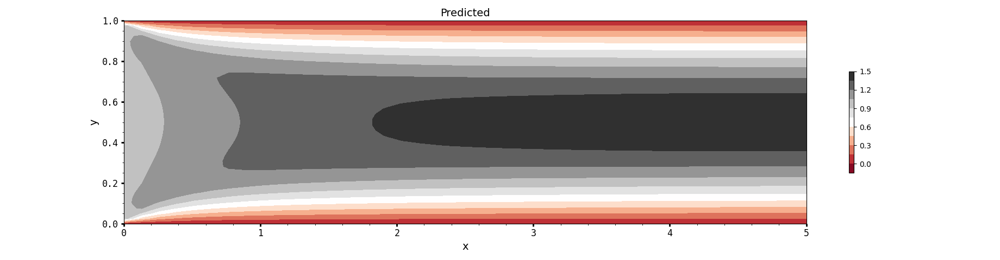

## Problem Description

This repository solves a two-dimensional channel flow problem using a Physics-Informed Neural Network (PINN).

The computational domain is a rectangular channel with the following dimensions and flow parameters:

- Channel length: $L = 5$
- Channel height: $H = 1$
- Inlet velocity: $U_{in} = 1$
- Kinematic viscosity: $\nu = 0.01$

The physical domain is defined as:

$$
0 \leq x \leq 5
$$

$$
0 \leq y \leq 1
$$

The Reynolds number is calculated based on the channel height:

$$
Re = \frac{U_{in}H}{\nu}
$$

Substituting the given values:

$$
Re = \frac{1 \times 1}{0.01} = 100
$$

Therefore, the Reynolds number is:

$$
Re = 100
$$

The boundary conditions are defined as follows:

- **Inlet:** uniform velocity

$$
u = 1, \quad v = 0
$$

- **Top and bottom walls:** no-slip condition

$$
u = 0, \quad v = 0
$$

- **Outlet:** zero pressure condition

$$
p = 0
$$

The objective is to predict the velocity and pressure fields inside the channel by satisfying the governing incompressible flow equations and the imposed boundary conditions. The PINN is trained using interior collocation points and boundary points to approximate the flow solution in the channel.

## Results
The predicted flow field and related results are shown below:

